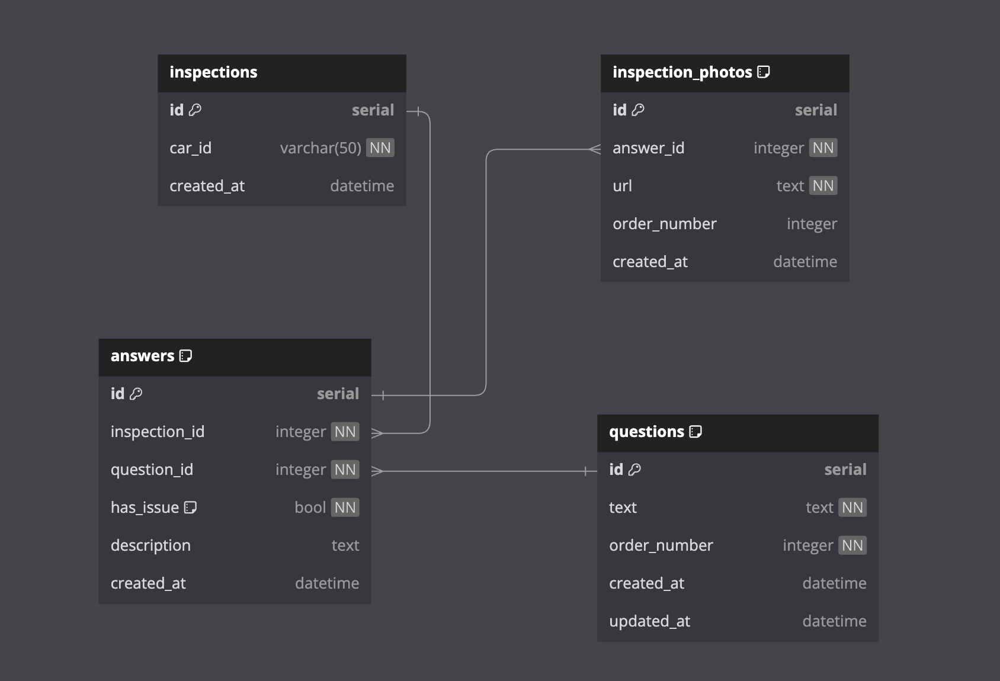

# Inspection API

## Overview
A simple REST API for managing vehicle inspections. The API allows users to retrieve inspection questions and previous inspection data for a given vehicle, as well as submit new inspection reports with answers and photo evidence.

## Features
- Retrieve inspection questions and previous inspection data for a given vehicle if available
- Submit new inspection reports with answers and photo evidence

## Running the Application
Run the application using Maven:
```
./mvnw spring-boot:run
```
The application will start on `http://localhost:8080`

## Swagger UI

The application provides a Swagger UI for testing the API endpoints. Access it at `http://localhost:8080/swagger-ui/index.html`

## API Endpoints

### Get Inspection Data
- **GET** `/api/inspections/{carId}`
- Retrieves inspection questions and previous inspection data (if available) for the specified car ID.

### Submit Inspection
- **POST** `/api/inspections`
- Submits a new inspection report for a vehicle.

## Database Schema
The application uses an PostgreSQL database to store inspection data on Docker. 

To start the database, run:
```
docker-compose up -d
```

The application uses the following main entities:
- `AnswerEntity`: Represents a vehicle inspection
- `InspectionEntity`: Stores inspection questions
- `InspectionPhotoEntity`: Contains responses to questions for a specific inspection
- `QuestionEntity`: Stores photo evidence URLs
  - To populate the database with sample data, run the `data.sql` script located in `src/main/resources`

The database schema is as follows:



## API Documentation

### 1. Get Inspection Data

Retrieves inspection data for a specific car, including questions and previous inspection details if available.

- **URL:** `/api/inspections/{carId}`
- **Method:** GET
- **URL Params:**
    - Required: `carId=[string]`

#### Success Response:
- **Code:** 200 OK
- **Content:**
```json
{
  "carId": "ABC123",
  "questions": [
    {
      "id": 1,
      "text": "Is there any visible damage?"
    },
    {
      "id": 2,
      "text": "Are the tires in good condition?"
    }
  ],
  "previousAnswers": [
    {
      "questionId": 1,
      "response": true,
      "description": "Minor scratch on the driver's door",
      "photoUrls": [
        "https://example.com/photos/abc123_q1_1.jpg",
        "https://example.com/photos/abc123_q1_2.jpg"
      ]
    },
    {
      "questionId": 2,
      "response": false,
      "description": null,
      "photoUrls": []
    }
  ]
}
```

### 2. Submit Inspection

Submits a new inspection for a car.

- **URL:** `/api/inspections`
- **Method:** POST
- **Data Params:**
```json
{
  "carId": "CAR123456",
  "answers": [
    {
      "questionId": 1,
      "hasIssue": true,
      "description": "Müzik çalmıyor",
      "photos": [
        {
          "url": "https://example.com/photos/music.jpg",
          "orderNumber": 1
        },
        {
          "url": "https://example.com/photos/screen.jpg",
          "orderNumber": 2
        }
      ]
    },
    {
      "questionId": 2,
      "hasIssue": false,
      "description": null,
      "photos": []
    },
    {
      "questionId": 3,
      "hasIssue": true,
      "description": "Ruhsatta eksiklik var",
      "photos": [
        {
          "url": "https://example.com/photos/ruhsat.jpg",
          "orderNumber": 1
        }
      ]
    }
  ]
}
```

#### Success Response:
- **Code:** 201 CREATED
- **Content:**
```json
{
  "carId": "CAR123456",
  "inspectionId": 1,
  "createdAt": "2024-08-24T12:26:02.921195",
  "questions": [
    {
      "id": 1,
      "text": "Multimedyada Problem var mı?",
      "orderNumber": 1,
      "answer": {
        "hasIssue": true,
        "description": "Scratch on front left door",
        "photoUrls": [
          "https://example.com/photos/scratch1.jpg",
          "https://example.com/photos/scratch2.jpg"
        ]
      }
    },
    {
      "id": 2,
      "text": "Ruhsatta eksiklik var mı?",
      "orderNumber": 2,
      "answer": {
        "hasIssue": false,
        "description": null,
        "photoUrls": []
      }
    },
    {
      "id": 3,
      "text": "Aküde eksiklik / problem var mı?",
      "orderNumber": 3,
      "answer": {
        "hasIssue": true,
        "description": "Low tire pressure in rear right tire",
        "photoUrls": [
          "https://example.com/photos/tire.jpg"
        ]
      }
    }
  ]
}
```

## Testing
Run the unit tests with:
```
./mvnw test
```

## Logging
- The application uses SLF4J for logging. Log files are located in the `logs` directory.
